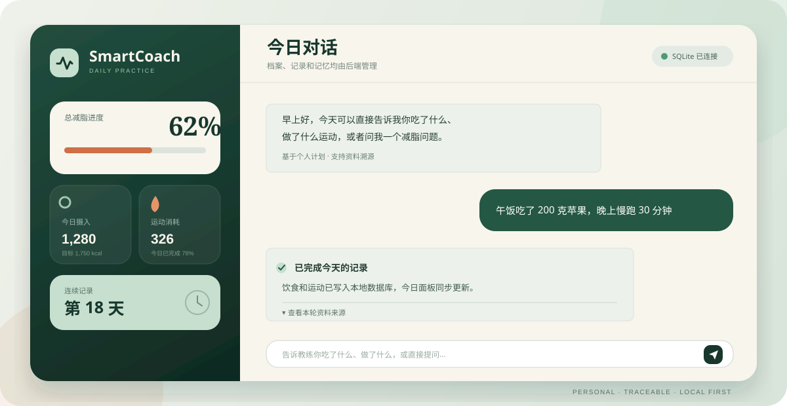
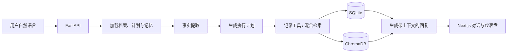

<div align="center">


# SmartCoach

**会记得、会记录、会查证的 AI 减脂教练。**

[](https://github.com/zzzzzooooo8/SmartCoach/actions/workflows/ci.yml)


[项目亮点](#项目亮点) · [工作流程](#工作流程) · [快速开始](#快速开始) · [数据与安全](#数据与安全)

</div>



SmartCoach 是一个前后端分离的中文 AI 减脂教练项目。用户可以直接用自然语言描述饮食、运动和身体变化；后端 Agent 负责识别事实、校验信息、更新记录、检索本地资料，并结合个人档案生成有上下文的回复。

> [!IMPORTANT]
> 本项目用于个人健康管理与 AI Agent 工程实践，不构成医疗诊断、治疗或个体化临床建议。

## 项目亮点

| 能力 | 说明 |
| --- | --- |
| 个性化建档 | 根据年龄、身高、体重、活动量和目标，计算 BMR、TDEE、热量与蛋白质目标 |
| 自然语言记录 | 从“午饭吃了 200 克苹果”等对话中提取饮食、运动和身体事件 |
| Agent 工作流 | 使用 LangGraph 编排上下文加载、事实分析、执行计划、工具调用和回复生成 |
| 混合 RAG | 融合 SQLite FTS5 关键词检索、Chroma 向量检索与可选重排模型 |
| 长短期记忆 | 保存饮食偏好、健康限制和对话摘要，过期健康信息会进入待确认状态 |
| 可追溯回复 | 前端可以展开本轮资料来源，区分模型表达与本地知识依据 |
| 本地优先 | 用户档案、记录、记忆与对话默认保存在本地 SQLite，向量索引保存在本地 ChromaDB |

## 工作流程



一次典型对话会经历：

1. 读取用户档案、减脂目标、近期对话和有效记忆。
2. 区分“已经发生的记录”“计划做的事情”和“知识问题”。
3. 只把信息完整且确认发生的事件写入数据库。
4. 在需要热量、运动或健康知识时检索本地资料。
5. 返回回复、数据面板更新、资料来源和执行告警。

## 技术栈

- 前端：Next.js 16、React 19、TypeScript、Tailwind CSS 4、Lucide React
- 后端：FastAPI、Pydantic、Uvicorn
- Agent：LangGraph、LangChain OpenAI-compatible client
- 数据：SQLite、FTS5、ChromaDB
- 模型：兼容 OpenAI API 协议的对话、Embedding 与 Rerank 服务
- 工程：uv、pnpm、GitHub Actions

## 项目结构

```text
SmartCoach/
├── frontend/                 # Next.js 前端
│   ├── app/                  # 页面、布局和全局样式
│   └── public/               # 静态资源
├── backend/                  # FastAPI 后端
│   ├── app/
│   │   ├── agent/            # LangGraph、事实提取、上下文与工具
│   │   ├── data/             # 本地知识源说明与运行时数据
│   │   ├── database.py       # SQLite 数据与 FTS5 索引
│   │   └── rag.py            # 混合检索与重排
│   ├── scripts/              # 知识库重建、迁移和冒烟测试
│   └── tests/                # 后端自动化测试
├── assets/                   # README 品牌素材
└── .github/workflows/        # 持续集成
```

## 快速开始

### 环境要求

- Python 3.12
- [uv](https://docs.astral.sh/uv/)
- Node.js 20 或更高版本
- [pnpm](https://pnpm.io/) 10

### 1. 启动后端

```powershell
cd backend
Copy-Item .env.example .env
uv sync --frozen
uv run python scripts\rebuild_knowledge.py --no-embeddings
uv run python main.py
```

根据注释填写 `backend/.env`。服务默认运行在 `http://127.0.0.1:8000`，健康检查地址为 `http://127.0.0.1:8000/api/health`。

没有配置对话模型时，后端仍会保存消息并使用降级回复；没有配置 Embedding 或 Rerank 服务时，知识库会退化为本地关键词检索。

### 2. 启动前端

另开一个终端：

```powershell
cd frontend
pnpm install --frozen-lockfile
pnpm dev
```

打开 `http://localhost:3000`。如后端不在默认地址，可在前端环境变量中设置：

```dotenv
NEXT_PUBLIC_API_BASE_URL=http://127.0.0.1:8000
```

## 配置说明

| 变量 | 用途 | 必需 |
| --- | --- | --- |
| `CHAT_MODEL_ENDPOINT` | 对话模型名称 | 生成模型回复时需要 |
| `OPENAI_API_KEY` / `OPENAI_BASE_URL` | OpenAI-compatible 对话服务 | 生成模型回复时需要 |
| `EMBEDDING_MODEL_ENDPOINT` | 向量模型名称 | 向量检索时需要 |
| `SILICON_API_KEY` / `SILICON_BASE_URL` | Embedding 服务 | 向量检索时需要 |
| `RERANK_MODEL_ENDPOINT` | 重排模型名称 | 可选 |
| `SQLITE_DATABASE_PATH` | 自定义 SQLite 路径 | 可选 |
| `CHROMA_PERSIST_DIRECTORY` | 自定义 ChromaDB 路径 | 可选 |

完整模板见 [`backend/.env.example`](backend/.env.example)。

## 知识库

仓库不会分发来源或再授权信息不完整的原始健康数据。请把你有权使用的资料放入 `backend/app/data/`，再运行知识库重建脚本。所需文件名、格式和注意事项见 [`backend/app/data/README.md`](backend/app/data/README.md)。

```powershell
cd backend
uv run python scripts\rebuild_knowledge.py
```

如果暂时没有 Embedding 服务：

```powershell
uv run python scripts\rebuild_knowledge.py --no-embeddings
```

## 验证

后端测试：

```powershell
cd backend
uv run python -m unittest discover -s tests -v
uv run python scripts\smoke_agent.py
```

前端检查：

```powershell
cd frontend
pnpm lint
pnpm build
```

GitHub Actions 会在推送和 Pull Request 时自动运行后端测试、前端 lint 与生产构建。

## 数据与安全

- `.env`、SQLite 文件、ChromaDB 索引和本地缓存均已从版本控制中排除。
- 用户档案、记录和记忆默认保存在本机；调用远程模型时，请自行确认服务商的数据处理政策。
- 不要提交真实 API Key、真实用户健康数据或未经许可再分发的知识资料。
- 涉及疾病、药物、进食障碍、孕期或明显不适时，应优先咨询合格的医疗专业人员。

## 当前状态

SmartCoach 目前处于个人项目开发阶段，适合本地运行和 Agent/RAG 学习验证，尚未针对多用户生产部署完成鉴权、审计、限流与合规建设。

计划中的改进：

- [ ] 增加真实产品截图与核心流程演示 GIF
- [ ] 增加用户登录与多用户隔离
- [ ] 增加前端组件测试与端到端测试
- [ ] 增加知识资料的版本、来源和授权元数据
- [ ] 增加容器化部署方案

## 许可证

本仓库当前未附带开源许可证，代码默认保留所有权。如需复用、分发或参与协作，请先联系仓库作者。
